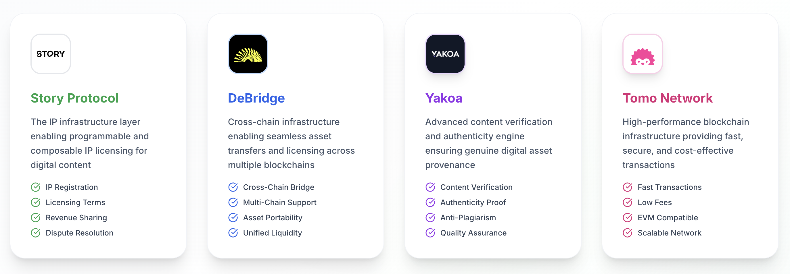

# CreativeIP - Comprehensive Architecture Documentation

<div align="center">

</div>

## 🎯 Overview

The Story IP Platform is a decentralized intellectual property management system that combines multiple blockchain technologies to provide seamless IP registration, verification, and cross-chain licensing. The platform integrates **Story Protocol**, **Yakoa verification**, **deBridge cross-chain payments**, and **Tomo wallet** to create a comprehensive IP ecosystem.

## 🔧 Core Services Integration

<div align="center">

</div>

### 1. **Story Protocol** - IP Registration & Licensing
- **Purpose**: On-chain IP registration and NFT minting
- **Network**: Story Aeneid Testnet (Chain ID: 1315)
- **Key Features**:
  - IP asset registration with metadata
  - NFT minting for IP ownership
  - Licensing framework for commercialization
  - Royalty distribution system

### 2. **Yakoa** - Content Verification
- **Purpose**: AI-powered content authenticity verification
- **Integration**: REST API for verification requests
- **Key Features**:
  - Image authenticity detection
  - Deepfake detection
  - Content originality verification
  - Verification badges and scoring

### 3. **deBridge** - Cross-Chain Payments
- **Purpose**: Multi-chain payment infrastructure for IP licensing 
- **Supported Networks**: Ethereum, Polygon, BSC, Arbitrum, Optimism, Base, Sepolia
- **Key Features**:
  - Cross-chain token transfers
  - License payment processing
  - Multi-chain fee estimation
  - Transaction monitoring

### 4. **Tomo Wallet** - Social Authentication
- **Purpose**: User-friendly wallet with social login
- **Integration**: EVM kit with viem/ethers.js signing
- **Key Features**:
  - Google/social login integration
  - EVM-compatible signing
  - Story Protocol transaction support
  - Multi-chain connectivity

## 🔄 Complete Workflow

### Phase 1: Asset Upload & Registration
```
User Upload → Content Processing → Yakoa Verification → Story Protocol Registration
     │              │                    │                        │
     ▼              ▼                    ▼                        ▼
┌─────────┐   ┌──────────┐        ┌─────────────┐         ┌─────────────┐
│Frontend │   │ Backend  │        │   Yakoa     │         │   Story     │
│Upload   │──►│IPFS/     │───────►│Verification │────────►│ Protocol    │
│Component│   │Metadata  │        │   API       │         │Registration │
└─────────┘   └──────────┘        └─────────────┘         └─────────────┘
```

### Phase 2: IP Licensing & Cross-Chain Payments
```
License Request → Payment Processing → Cross-Chain Transfer → License Activation
       │                 │                     │                    │
       ▼                 ▼                     ▼                    ▼
┌─────────────┐   ┌─────────────┐      ┌─────────────┐      ┌─────────────┐
│   Frontend  │   │  deBridge   │      │Cross-Chain  │      │   Story     │
│License Modal│──►│ Payment     │─────►│  Transfer   │─────►│ Protocol    │
│             │   │ Service     │      │ Monitoring  │      │ Licensing   │
└─────────────┘   └─────────────┘      └─────────────┘      └─────────────┘
```

## 📁 Project Structure

```
story/
├── frontend/                    # Next.js React Frontend
│   ├── src/
│   │   ├── app/                # Next.js App Router Pages
│   │   │   ├── dashboard/      # User Dashboard
│   │   │   ├── upload/         # Asset Upload Flow
│   │   │   ├── gallery/        # Asset Gallery
│   │   │   ├── search/         # Asset Search & Discovery
│   │   │   └── models/         # AI Model Gallery
│   │   ├── components/         # React Components
│   │   │   ├── AssetUpload/    # Upload Components
│   │   │   ├── Search/         # Search Components
│   │   │   ├── CrossChain/     # deBridge Components
│   │   │   └── Verification/   # Yakoa Components
│   │   ├── hooks/              # React Hooks
│   │   │   ├── useStoryProtocol.ts    # Story Protocol Integration
│   │   │   ├── useCrossChainPayment.ts # deBridge Integration
│   │   │   └── useYakoaVerification.ts # Yakoa Integration
│   │   ├── config/             # Configuration Files
│   │   │   ├── wagmiConfig.ts  # Wallet Configuration
│   │   │   ├── tomoConfig.ts   # Tomo Wallet Config
│   │   │   └── deBridgeConfig.ts # deBridge Configuration
│   │   └── utils/              # Utility Functions
│   └── package.json
├── backend/                     # Express.js Backend
│   ├── src/
│   │   ├── config/             # Backend Configuration
│   │   │   ├── firebase.ts     # Firebase Admin Setup
│   │   │   ├── elasticsearch.ts # Search Configuration
│   │   │   └── yakoa.ts        # Yakoa API Configuration
│   │   ├── utils/              # Backend Utilities
│   │   │   ├── assetProcessor.ts # Asset Processing
│   │   │   ├── searchService.ts  # Elasticsearch Integration
│   │   │   └── yakoaService.ts   # Yakoa API Service
│   │   └── index.ts            # Express Server
│   └── package.json
```

## 🚀 Getting Started

### Prerequisites

- Node.js 18+ and npm
- Git
- Access to the following services:
  - Story Protocol Aeneid Testnet
  - Yakoa API credentials
  - deBridge API access
  - Firebase project
  - Elasticsearch instance

### 1. Clone and Install

```bash
# Clone the repository
git clone https://github.com/0xSY3/storyfinal.git
cd storyfinal

# Install frontend dependencies
cd frontend
npm install

# Install backend dependencies
cd ../backend
npm install
```

### 2. Environment Configuration

#### Frontend (.env.local)
```env
# deBridge Configuration
NEXT_PUBLIC_DEBRIDGE_API_KEY=your_debridge_api_key
NEXT_PUBLIC_DEBRIDGE_ENVIRONMENT=testnet

# Story Protocol
NEXT_PUBLIC_STORY_RPC_URL=https://aeneid.rpc.story.foundation
NEXT_PUBLIC_STORY_CHAIN_ID=1315

# Backend API
NEXT_PUBLIC_BACKEND_URL=http://localhost:3001
```

#### Backend (.env)
```env
# Story Protocol Configuration
STORY_PRIVATE_KEY=your_story_private_key
STORY_RPC_URL=https://aeneid.rpc.story.foundation
STORY_NFT_CONTRACT=0x322813Fd9A801c5507c9de605d63CEA4f2CE6c44

# Yakoa API Configuration
YAKOA_API_KEY=your_yakoa_api_key
YAKOA_API_URL=https://api.yakoa.com

# Firebase Configuration
FIREBASE_PROJECT_ID=your_firebase_project_id
FIREBASE_PRIVATE_KEY=your_firebase_private_key
FIREBASE_CLIENT_EMAIL=your_firebase_client_email

# Elasticsearch Configuration
ELASTICSEARCH_URL=your_elasticsearch_url
ELASTICSEARCH_API_KEY=your_elasticsearch_api_key
```

### 3. Run the Application

```bash
# Start the backend server
cd backend
npm run dev

# Start the frontend (in a new terminal)
cd frontend
npm run dev
```

The application will be available at `http://localhost:3000`

## 🔐 Wallet Integration with Tomo

### Signing Story Protocol Transactions

The platform uses Tomo wallet's EVM kit for signing Story Protocol transactions. Based on Tomo team's guidance, we use viem and ethers.js APIs for custom transaction signing:

## 💸 Cross-Chain Payment Flow

### deBridge Integration

The platform supports cross-chain payments for IP licensing using deBridge's DLN protocol:

> **Current Status**: Enhanced simulation mode with testnet support. Real API integration available when SDK methods are verified.

#### Supported Networks
- **Testnets**: Ethereum Sepolia, Polygon Mumbai, Arbitrum Goerli
- **Story Protocol**: Story Aeneid Testnet

#### Payment Tokens
- **USDC**: Across all supported networks
- **USDT**: Primary stablecoin for licensing
- **Native Tokens**: ETH, MATIC, BNB, AVAX

#### Payment Process
1. **Estimation**: Get cross-chain payment quote
2. **Order Creation**: Create DLN order for license payment
3. **Monitoring**: Track payment status across chains
4. **Completion**: Activate license upon payment confirmation

## 🔍 Asset Verification with Yakoa

### Verification Process

1. **Upload**: Asset uploaded to platform
2. **Preprocessing**: Extract metadata and features
3. **API Call**: Send to Yakoa verification service
4. **Analysis**: AI-powered authenticity check
5. **Result**: Verification score and badge assignment

### Verification Types
- **Image Authenticity**: Detect manipulated images
- **Deepfake Detection**: Identify AI-generated faces
- **Content Originality**: Check for duplicates
- **Metadata Validation**: Verify creation details

## 📊 API Endpoints

### Backend API Routes

#### Asset Management
```
POST /api/assets/upload          # Upload asset
GET  /api/assets/search          # Search assets
GET  /api/assets/:id             # Get asset details
POST /api/assets/:id/verify      # Request verification
```

#### Story Protocol Integration
```
POST /api/story/register         # Register IP asset
GET  /api/story/assets/:id       # Get Story Protocol asset
POST /api/story/license          # Create license
```

#### Cross-Chain Payments
```
POST /api/payments/estimate      # Estimate cross-chain payment
POST /api/payments/create        # Create payment order
GET  /api/payments/:id/status    # Check payment status
```

#### Verification Services
```
POST /api/verification/submit    # Submit for verification
GET  /api/verification/:id       # Get verification status
POST /api/verification/batch     # Batch verification
```

## 🧪 Testing Configuration

### Testnet Setup

For safe testing, the platform is configured to use testnets:

#### deBridge Testnet Configuration
- **Sepolia**: Primary Ethereum testnet
- **Polygon Mumbai**: Polygon testnet
- **Arbitrum Goerli**: Arbitrum testnet
- **Test Tokens**: USDC/USDT on respective testnets

#### Story Protocol Testnet
- **Network**: Story Aeneid Testnet
- **Chain ID**: 1315
- **RPC**: https://aeneid.rpc.story.foundation
- **Faucet**: Available for SIP tokens

### Getting Test Tokens

1. **Sepolia ETH**: Use Sepolia faucet
2. **Test USDC/USDT**: Use respective testnet faucets
3. **Story SIP**: Use Story testnet faucet
4. **Other Testnets**: Use official faucets for each network

### Enabling Real deBridge Integration

To enable actual deBridge API calls (currently in enhanced simulation mode):

1. **Set Environment Variables**:
   ```env
   NEXT_PUBLIC_DEBRIDGE_API_KEY=your_api_key
   NEXT_PUBLIC_DEBRIDGE_ENVIRONMENT=testnet
   ```

2. **Update Service**: In `deBridgeService.ts`, set `REAL_DEBRIDGE_ENABLED = true`

3. **Verify API Methods**: Test the deBridge SDK methods and update the service calls accordingly

## 🔧 Development Guide

### Adding New Features

1. **Frontend Components**: Add to `/frontend/src/components/`
2. **API Hooks**: Create in `/frontend/src/hooks/`
3. **Backend Routes**: Add to `/backend/src/`
4. **Configuration**: Update config files as needed

### Code Style

- **TypeScript**: Strict mode enabled
- **ESLint**: Configured for Next.js
- **Prettier**: Auto-formatting enabled
- **Imports**: Use absolute imports with `@/` prefix

### Testing

```bash
# Frontend testing
cd frontend
npm run test

# Backend testing
cd backend
npm run test

# Linting
npm run lint
```


### Support

For technical support:
1. Check console logs for error details
2. Verify environment configuration
3. Test with smaller files first
4. Contact development team with specific error messages

## 📝 License

This project is licensed under the MIT License - see the LICENSE file for details.

## 🤝 Contributing

1. Fork the repository
2. Create a feature branch
3. Make your changes
4. Add tests if applicable
5. Submit a pull request


